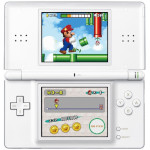

# Nintendo DS Lite

  
|Component    |Description                              |
|-------------|-----------------------------------------|
|CPU	        |ARM946-S 67MHz + ARM7TDMI 33MHz          |
|RAM	        |4MB                                      |
|Top Screen	  |3.12" 256x192                            |
|Bottom Screen|3.12" 256x192 (Resistive Touch)          |
|Slot	        |Cartridge (NDS and GBA)                  |
|WLAN	        |Wi-Fi 802.11 g                           |
|Gamepad	    |DPad, 4 Buttons, Start, Select, L1 and R1|
|Battery	    |3.7V 1000mA                              |
|Dimension	  |133mm x 73.9mm x 21.5mm                  |
|Weight	      |218g                                     |

### https://steward-fu.github.io/website/index.htm
